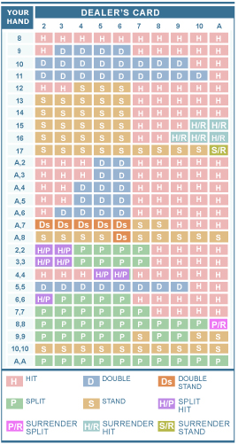

Bem-vindo ao Blackjack! A 42Algorítmos tem a satisfação de anunciar que a emoção
do blackjack agora está disponível na 42Algorítmos. Agora se você quiser jogar
algumas mãos de blackjack enquanto estiver jogando pôquer, ou no meio de suas
sessões de pôquer, você pode simplesmente sentar-se em uma mesa de blackjack
da 42Algorítmos!

# Regras do Blackjack
---------------------

## Regras Básicas
------------------

  - Cada jogador está jogando contra o carteador. O objetivo do blackjack é
    ter uma mão maior do que a do carteador sem ultrapassar 21. Cada carta tem
    um valor que é adicionado para formar o total da mão.
  - Os valores das cartas são os seguintes: As figuras (Rei, Rainha e Valete)
    valem 10 e Ases valem 1 ou 11. Não há regra para o Ás valer 1 ou 11 e você
    não precisa dizer nada, ele vale o que for melhor para sua mão. Todas as
    outras cartas (2 - 10) valem de acordo com o seu número. Os naipes não têm
    significado neste jogo.
  - Uma mão com um Ás representa um 'soft total' se o Ás puder ter o valor de
    1 ou 11 sem ultrapassar 21. O jogador pode pedir outra carta e utilizar o
    valor menor para o Ás para evitar estourar. Se você tiver que utilizar ou
    um valor ou outro, chama-se 'hard total.'
  - O jogo é disputado com oito baralhos de cartas, embaralhados após cada
    mão.
  - A 42Algorítmos oferece atualmente somente blackjack de mão única e único
    jogador. É estritamente você vs. o carteador sem nenhum outro jogador na
    mesa, e você só pode disputar uma mão por jogo.

## Jogando Blackjack
--------------------

  - Depois que forem feitas as apostas, o jogador e o carteador recebem duas
    cartas.
  - O carteador mostra uma das suas cartas e a outra permanece com a face para
    baixo até o final do jogo.
  - O jogo começa com o jogador dizendo ao carteador como ele quer jogar sua
    mão durante a sua rodada.
  - Depois que todos os jogadores finalizarem suas mãos, o carteador
    finalizará a sua e então pagará ou coletará as apostas.
  - Se você receber 21 em suas duas primeiras cartas (Ás e 10), você tem um
    blackjack. Ter um blackjack significa que você ganha 1,5 do valor de sua
    aposta.

## Estratégia Básica Otimizada Para Jogar Blackjack
-----------------------------------------------------

O quadro abaixo mostra os exemplos estatísticos onde você deveria teoricamente
fazer hit (pedir cartas), stand (ficar), double (dobrar) ou split (dividir)
sua mão, dependendo do total da sua mão e do valor da carta visível do
carteador. É uma ferramenta de estratégia útil e deve ser consultada ao jogar
blackjack on-line. Isso é especialmente útil para jogadores novatos. Consulte
as especificações de estratégias de blackjack a seguir:

## Abandono
-----------

  - Abandonar é fazer fold em uma mão com a metade do custo da aposta
    original.
  - As mãos só podem ser abandonadas no início do jogo antes de qualquer outra
    ação como fazer hit, split ou double.
  - Só abandonar uma mão se a chance de vencer for de 25% ou menos.

## Fazendo hit ou stand
-----------------------

  - Hit é solicitar mais uma carta e aumentar o valor total da mão.
  - Stand é manter a mão atual e finalizar a rodada.
  - Para obter melhores resultados, consulte a tabela de estratégia de
    blackjack à direita.

## Fazendo split de pares
-------------------------

  - Você tem a opção de fazer split de sua mão quando receber duas cartas do
    mesmo valor (incluindo quaisquer cartas de valor 10), sendo as duas
    primeiras cartas do jogo, independentemente do naipe.
  - Fazer split significa que o par é dividido em duas mãos separadas e
    freqüentemente é uma boa estratégia, a não ser que as cartas sejam ambas
    de valor 10. Consulte a tabela de estratégia de blackjack à direita para
    ver os melhores casos.
  - Fazer split dobra a aposta, porque as duas novas mãos devem ter o mesmo
    valor da aposta original.
  - Um jogador pode fazer split de pares adicionais resultantes do split
    original até o máximo de 3 splits em um jogo.
  - Se você receber dois Ases você pode fazer split mas só poderá pedir uma
    carta para cada Ás. Se você receber um dez, você fará 21, mas não contará
    como "Blackjack." Em outras palavras, é paga como uma mão que simplesmente
    totalizou 21, não para pagamento de 3-2 como Blackjack de 2 cartas. É
    sempre uma boa estratégia fazer split com Ases.

## Fazendo Double
-----------------

  - O double deve ser feito para uma mão de duas cartas antes de receber uma
    terceira carta.
  - Isso é similar a um hit, mas a aposta pode ser dobrada e somente mais uma
    carta será adicionada à mão. Nenhuma carta poderá ser pedida depois da
    terceira carta se um jogador escolher fazer double.
  - Um jogador pode fazer double sobre o valor de sua aposta original.
  - Para obter melhores resultados, consulte a tabela de estratégia de
    blackjack acima.
  - For best results, consult the blackjack strategy table above.

## Segurança
-------------

  - O carteador oferecerá uma aposta de segurança aos jogadores se sua carta
    mostrada for um Ás, para o caso de a segunda carta ter o valor de 10. Essa
    é uma aposta à parte e não afeta o montante original.
  - As apostas de segurança têm a metade da aposta original e são pagas com
    uma vantagem de 2 para 1.
  - Se o jogador fizer a aposta de segurança e o carteador tiver blackjack,
    ninguém ganha nem perde.

## Como Joga o Carteador
------------------------

O carteador tem regras estritas para jogar blackjack e não pode desviar-se
delas. Ele não pode fazer split ou double. O carteador da 42Algorítmos segue a
regra "Dealer hits soft 17", que funciona da seguinte maneira:

  - O carteador deve continuar a fazer hit (pedir cartas) até que sua mão
    totalize 17 ou mais, onde ele deverá fazer stand (parar de pedir cartas).
  - Um Ás na mão do carteador sempre tem o valor de 11, a menos que ele faça o
    carteador passar de 21.
  - Se o carteador tiver um 'soft total' de 17(onde o Ás pode ser 1 ou 11 sem
    fazer a mão estourar) o carteador pedirá mais cartas e fará stand em 18
    'soft' ou mais, ou 17 'hard' ou mais.

